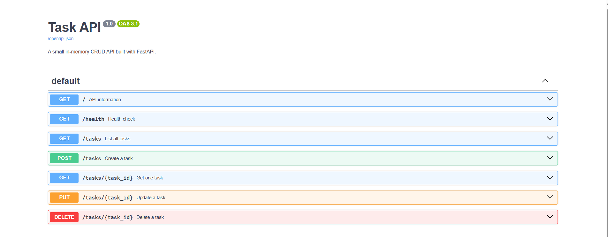

# Task CRUD API

A small in-memory Task CRUD API built with **Python + FastAPI** for FlyRank Backend AI Engineering — Week 2, Assignment A1: Build Your First CRUD API.

## What this project does

This API manages a simple to-do list without a database. Data is stored only in memory, so restarting the server resets the task list.

## Requirements

- Python 3.10+
- FastAPI
- Uvicorn
- Git

## Install and run

### 1. Create a virtual environment

PowerShell:

```powershell
python -m venv .venv
```

### 2. Activate it

```powershell
.\.venv\Scripts\Activate.ps1
```

If PowerShell blocks activation, you can run:

```powershell
Set-ExecutionPolicy -ExecutionPolicy RemoteSigned -Scope CurrentUser
```

Then activate again.

### 3. Install dependencies

```powershell
pip install -r requirements.txt
```

### 4. Start the API

```powershell
uvicorn app.main:app --reload
```

The API runs at:

- http://localhost:8000/
- Swagger UI: http://localhost:8000/docs

## Endpoints

| Method | Endpoint | Purpose | Success |
|---|---|---|---|
| GET | `/` | API information | 200 |
| GET | `/health` | Health check | 200 |
| GET | `/tasks` | List all tasks | 200 |
| GET | `/tasks/{id}` | Get one task | 200 |
| POST | `/tasks` | Create a task | 201 |
| PUT | `/tasks/{id}` | Update a task | 200 |
| DELETE | `/tasks/{id}` | Delete a task | 204 |

Error responses use JSON with an `error` message, matching the assignment requirement.

## Example curl output

```text
curl -i http://localhost:8000/health

HTTP/1.1 200 OK
content-type: application/json

{"status":"ok"}
```

## CRUD test flow

### Read all

```powershell
curl.exe -i http://localhost:8000/tasks
```

### Read one

```powershell
curl.exe -i http://localhost:8000/tasks/1
```

### Create

```powershell
curl.exe -i -X POST http://localhost:8000/tasks `
  -H "Content-Type: application/json" `
  -d '{"title":"Buy milk"}'
```

Expected status: `201 Created`.

### Update

```powershell
curl.exe -i -X PUT http://localhost:8000/tasks/4 `
  -H "Content-Type: application/json" `
  -d '{"title":"Buy milk and bread","done":true}'
```

Expected status: `200 OK`.

### Delete

```powershell
curl.exe -i -X DELETE http://localhost:8000/tasks/4
```

Expected status: `204 No Content`.

### 404 test

```powershell
curl.exe -i http://localhost:8000/tasks/99
```

Expected status: `404 Not Found`.

## Swagger UI



Open:

http://localhost:8000/docs

Use **Try it out** to test the complete CRUD flow:

1. GET `/tasks`
2. POST `/tasks`
3. GET the created task
4. PUT the task
5. DELETE the task
6. GET it again to confirm it is gone

Take a screenshot of the Swagger UI showing the endpoint list and successful test responses, then add it to this README before submission.

## In-memory storage

There is intentionally no database. The `tasks` list lives in Python memory. If the server restarts, newly created/updated/deleted data is lost and the three example tasks are loaded again.

## Assignment checklist

- [x] Stage 0 — Hello server
- [x] Stage 1 — Root and health
- [x] Stage 2 — Read endpoints + 404
- [x] Stage 3 — Create + validation
- [x] Stage 4 — Update + Delete
- [x] Stage 5 — Swagger UI
- [x] Stage 6 — GitHub-ready README
- [ ] Add Swagger screenshot before final submission
- [ ] Push to a public GitHub repository
- [ ] Keep one meaningful commit per stage

## Suggested Git commit history

```text
Stage 0: hello server
Stage 1: root and health endpoints
Stage 2: read endpoints with 404
Stage 3: create with validation
Stage 4: full CRUD
Stage 5: Swagger UI
Stage 6: publish and docs
```

